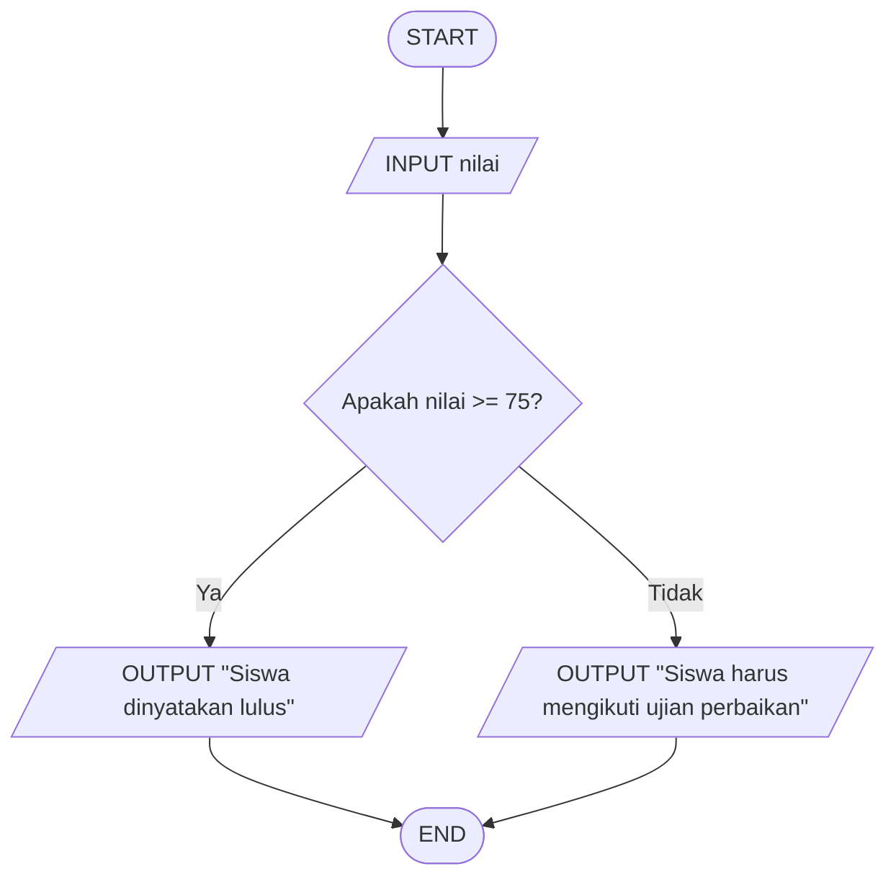

# Algoritma-Pemrograman-2026
Ajeng.Azmira.Nur,2225250120
# Logika Matematika - Penentuan Kelulusan Ujian
## 📝Deskripsi Masalah
Di sebuah sekolah SMA, terdapat aturan mengenai kelulusan ujian matematika. Siswa dinyatakan lulus apabila mendapatkan nilai 75 atau lebih, sedangkan siswa yang mendapatkan nilai kurang dari 75 dinyatakan belum lulus dan harus mengikuti ujian perbaikan. Masalah ini dapat digunakan untuk menerapkan logika matematika dalam menentukan suatu keputusan berdasarkan kondisi yang diberikan. Program akan menerima nilai ujian matematika siswa sebagai input, kemudian mengevaluasi apakah nilai tersebut memenuhi batas kelulusan. Berdasarkan hasil evaluasi tersebut, program akan menentukan apakah siswa lulus atau harus mengikuti ujian perbaikan.
## 📥 Input-Proses-Output
•	Input: Nilai ujian matematika yang diperoleh siswa.

•	Proses: Program membandingkan nilai siswa dengan batas kelulusan yaitu 75. Jika nilai 75 atau lebih, siswa dinyatakan lulus. Jika nilai kurang dari 75, siswa harus mengikuti ujian perbaikan.

•	Output: Keterangan apakah siswa lulus atau harus mengikuti ujian perbaikan.

## 💻 Pseudocode

```text
START

INPUT nilai

IF nilai >= 75 THEN
    OUTPUT "Siswa dinyatakan lulus"
ELSE
    OUTPUT "Siswa harus mengikuti ujian perbaikan"
END IF

END
```

## 📊 Flowchart



## 🧪 Test Case

### Test Case 1
- **Input:** 85
- **Kondisi:** Nilai >= 75
- **Output:** Siswa dinyatakan lulus

### Test Case 2
- **Input:** 65
- **Kondisi:** Nilai < 75
- **Output:** Siswa harus mengikuti ujian perbaikan

### Tabel Pengujian

| Test Case | Input Nilai | Kondisi | Hasil yang Diharapkan |
|-----------|-------------|---------|------------------------|
| 1 | 85 | Nilai >= 75 | Siswa dinyatakan lulus |
| 2 | 65 | Nilai < 75 | Siswa harus mengikuti ujian perbaikan |

## 🐍 Implementasi Python

Implementasi program dibuat menggunakan bahasa pemrograman Python dan dijalankan melalui Visual Studio Code. [main.py](main.py)

## 📸Hasil Pengujian

Program telah berhasil diuji menggunakan dua nilai, yaitu 85 dan 65 sesuai dengan test case. Nilai 85 menghasilkan output "Siswa dinyatakan lulus", sedangkan nilai 65 menghasilkan output "Siswa harus mengikuti ujian perbaikan", sesuai dengan kondisi yang telah ditentukan.


python main.py
